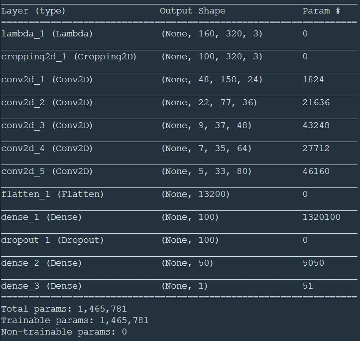
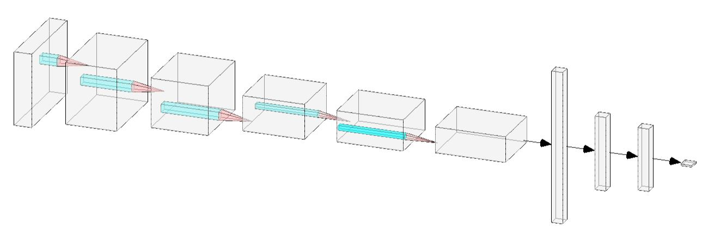
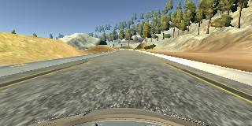
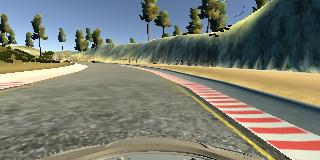
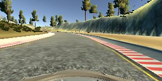
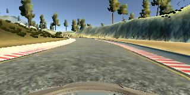
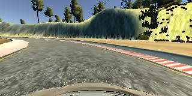
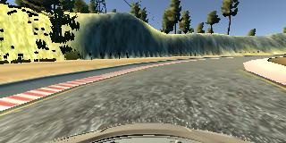
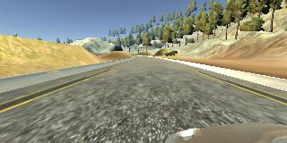
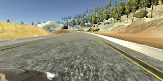

# **Behavioral Cloning** 

## Writeup

---

**Behavioral Cloning Project**

The goals / steps of this project are the following:
* Use the simulator to collect data of good driving behavior
* Build, a convolution neural network in Keras that predicts steering angles from images
* Train and validate the model with a training and validation set
* Test that the model successfully drives around track one without leaving the road
* Summarize the results with a written report

## Rubric Points
### Here I will consider the [rubric points](https://review.udacity.com/#!/rubrics/432/view) individually and describe how I addressed each point in my implementation.  

---
### Files Submitted & Code Quality

#### 1. Submission includes all required files and can be used to run the simulator in autonomous mode

My project includes the following files:
* model.py containing the script to create and train the model
* drive.py for driving the car in autonomous mode
* model.h5 containing a trained convolution neural network 
* writeup_report.md summarizing the results
* video.mp4 recording vehicle driving autonomously around the track one.
* track2.mp4 recording vehicle driving autonomously around the track two.

#### 2. Submission includes functional code
Using the Udacity provided simulator and my drive.py file, the car can be driven autonomously around the track by executing 
```sh
python drive.py model.h5
```

#### 3. Submission code is usable and readable

The model.py file contains the code for training and saving the convolution neural network. The file shows the pipeline I used for training and validating the model, and it contains comments to explain how the code works.

### Model Architecture and Training Strategy

#### 1. An appropriate model architecture has been employed

I used a pre-trained VGG16 model(vgg_model.py lines 63) as a start point. It consisted of 13 convolutional layers with 3x3 filter sizes and depths between 64 and 512, 5 pooling layers with 2x2 filter sizes, and 3 fully-connected layer(vgg_model.py lines 75-79) with ReLu activation function to introduce nonlinearity. This model was worked fine in track one, but did not perform well in track two.

So I decided to build my model based on Nvidia's architecture, it consists of a convolution neural network with 3 convolutional layers with 5x5 filters sizes and depths between 24 and 48, 2 convolutional layers with 3x3 filter sizes with 64 and 80 depths, and 3 fully-connected layers(model.py lines 68-71). The 5 convolutional layers(model.py lines 62-66) use ReLu activation function to introduce nonlinearity.

The data is normalized in the model using a Keras lambda layer and cropped to reduce noise. 

#### 2. Attempts to reduce overfitting in the model

The model contains a dropout layer in order to reduce overfitting (model.py lines 69). 

I also did data augmentation in python generator(model.py lines 19-49) to reduce overfitting. The model was tested by running it through the simulator and ensuring that the vehicle could stay on the track.

#### 3. Model parameter tuning

The model used an Adam optimizer, so the learning rate was not tuned manually (model.py line 73).
I only tuned the batch size, and found size 32 works better than others for my model.

#### 4. Appropriate training data

Training data was chosen to keep the vehicle driving on the road. I used a combination of center lane driving, recovering from the left and right sides of the road for 3 laps of clockwise and counter-clockwise.

For details about how I created the training data, see the next section. 

### Model Architecture and Training Strategy

#### 1. Solution Design Approach

The overall strategy for deriving a model architecture was to try some models that have been developed.

My first step was to use a convolution neural network model similar to the VGG16, I thought this model might be appropriate because of its flexibility, I can use 65x320x3 dimension as an input. But the training speed was quite slow, and it did not perform well in the track two.
So I used another convolution neural network model similar to the one Nvidia developed for self-driving car.

In order to gauge how well the model was working, I split my image and steering angle data into a training and validation set. I found that my first model had a low mean squared error on the training set but a high mean squared error on the validation set. This implied that the model was overfitting. 

To combat the overfitting, I added a dropout layers in the model and did data augmentation by flipping the images horizontally.

The final step was to run the simulator to see how well the car was driving around track one. The vehicle fell off the track at the first left sharp turn, to improve the driving behavior in these cases, I tried to get more data by using not just center camera images, also right and left camera images,and increase the number of filters in the last convlutional layers(from 64 to 80), also increase the training epochs(from 3 to 5).

At the end of the process, the vehicle is able to drive autonomously around the track one and track two without leaving the road.

#### 2. Final Model Architecture

The final model architecture (model.py lines 59-71) consisted of a convolution neural network with 3 convolutional layers with 5x5 filters sizes and depths between 24 and 48, 2 convolutional layers with 3x3 filter sizes with 64 and 80 depths, and 3 fully-connected layers.

Here is a visualization of the architecture:





#### 3. Creation of the Training Set & Training Process

To capture good driving behavior, I first recorded two laps on track one(counter-colckwise) and track two using center lane driving. Here is an example image of center lane driving:



I then recorded the vehicle recovering from the left side and right sides of the road back to center so that the vehicle would learn to steer back to the center. These images show what a recovery looks like starting from right side of road back to center:









Then I repeated this process, recorded track one and track two driving clockwise in order to get more data points.

To augment the data set, I flipped images and angles thinking that this would make my model not just learning to steer to left, also learning to steer to right, and my data will be more comprehensive. For example, here is an image that has then been flipped:






I also used the left and right camera images to get more data and thinking that this would also help teaching model how to steer back to the center if the vehicle drifting off to the side. Here are two images from left and right camera:






After the collection process, I had 175500 number of data points. I then preprocessed this data by normalizing and cropping the upper and lower part of image to reduce noise.

I finally randomly shuffled the data set and put 20% of the data into a validation set. 

I used this training data for training the model. The validation set helped determine if the model was over or under fitting. The ideal number of epochs was 5 as evidenced by experimenting. I used an Adam optimizer so that manually training the learning rate wasn't necessary.
